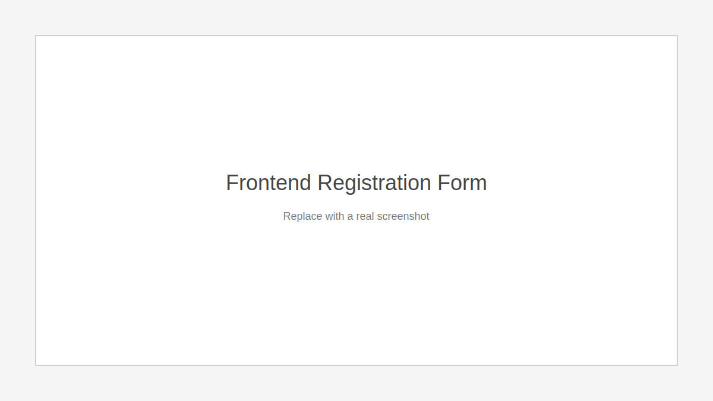
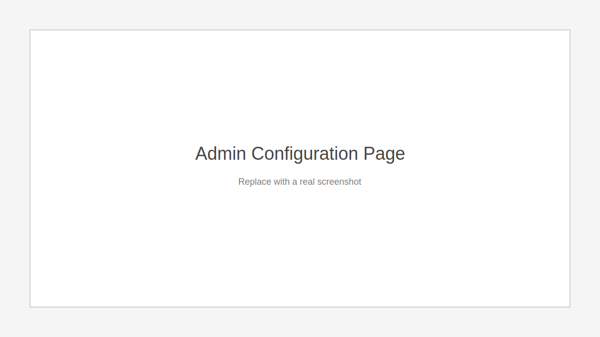
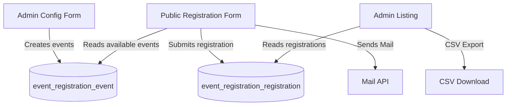

# Drupal Event Registration

A production-ready Drupal 10 custom module that enables event registration via a public form, stores registrations in custom tables, and sends email notifications to both users and admins. This repository is structured as a full Drupal project so it can be cloned and run directly.

**Base URL (for all links below):** `http://localhost:8888`

## Live Links
- Frontend registration form: `http://localhost:8888/event-registration`
- Admin event config: `http://localhost:8888/admin/config/event-registration/events`
- Admin settings: `http://localhost:8888/admin/config/event-registration/settings`
- Admin registrations list: `http://localhost:8888/admin/reports/event-registrations`
- Login: `http://localhost:8888/user/login`

If your site runs on a different URL, update all links above to match your environment.

## Highlights
- Admin config page for events and registration windows
- Public registration form available only within the configured date window
- Ajax-dependent dropdowns (Category → Event Date → Event Name)
- Duplicate protection using Email + Event Date
- Custom database tables for events and registrations
- CSV export for admin reporting
- Email notifications (user + optional admin)
- Clean DI-based architecture (no `\Drupal::service()` in business logic)

## Quick Start
1. Install dependencies:
   `composer install`
2. Ensure your Drupal site is running and database is configured.
3. Enable the module:
   `drush en event_registration`
4. Run updates to create tables:
   `drush updb -y`
5. Clear cache:
   `drush cr`

## Frontend, Backend, Database (Walkthrough)
A step-by-step walkthrough is in `docs/DEMO.md`.

## Screenshots (Placeholders)
Replace these with real screenshots when your site is running.

## Architecture Overview

## Key Documentation
- Setup Guide: `docs/SETUP.md`
- Architecture: `docs/ARCHITECTURE.md`
- Database Design: `docs/DATABASE.md`
- Walkthrough: `docs/DEMO.md`

## Permissions
- `administer event registrations` for event configuration and settings
- `view event registrations` for the admin listing page and CSV export

## Database Tables
A SQL dump is included in `event_registration.sql`.

### `event_registration_event`
Stores admin-configured events and registration windows.
- `id`
- `reg_start`
- `reg_end`
- `event_date`
- `event_name`
- `category`

### `event_registration_registration`
Stores user registrations.
- `id`
- `full_name`
- `email`
- `college`
- `department`
- `category`
- `event_date`
- `event_name`
- `event_id`
- `created`

## Validation Rules
- Email format is validated
- Text fields allow only letters, numbers, and spaces
- Duplicate registrations blocked using Email + Event Date
- User-friendly validation messages

## Email Notifications
Uses the Drupal Mail API.
- Confirmation email to the user
- Optional admin notification (configurable)

Email content includes:
- Name
- Event Date
- Event Name
- Category

## Resume Bullet (Use This)
Built a Drupal 10 custom module for event registration featuring dynamic Form API workflows, Ajax-driven filters, custom database schema, and Mail API notifications with admin reporting and CSV export.
