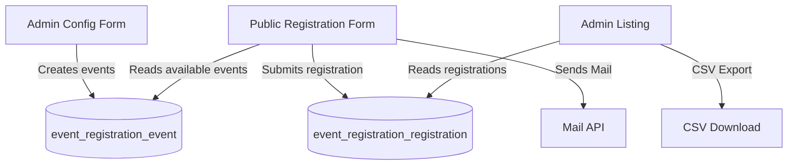

# Architecture Overview

## Key Components
- `EventConfigForm`: Admin form to define events and registration windows
- `EventRegistrationForm`: Public form with Ajax-dependent selects
- `EventRegistrationAdminListForm`: Admin reporting with CSV export
- `EventRegistrationStorage`: DI-based storage layer for DB access

## Data Flow (Mermaid)

## Data Flow Summary
1. Admin config creates events and registration windows.
2. Public form reads only open events based on today’s date.
3. Submissions are validated and stored.
4. Mail API sends notifications to user and admin.
5. Admin listing filters registrations and provides CSV export.
