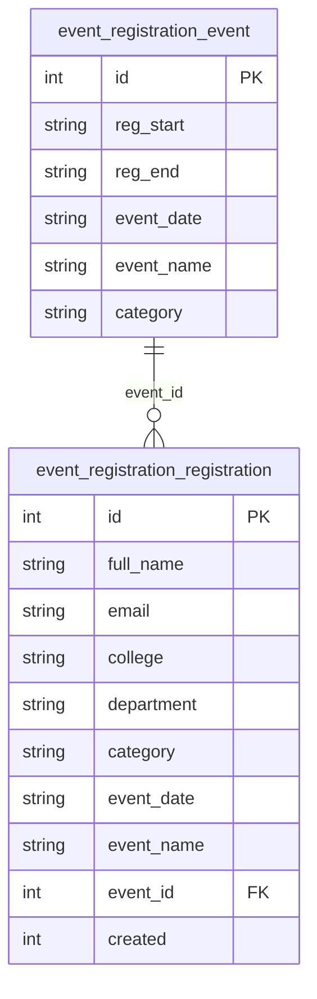

# Database Page

This page documents the custom database schema used by the Event Registration module and how to verify data in a real environment.

## Tables Overview

### `event_registration_event`
Stores admin-configured events and registration windows.

Columns:
- `id` (PK)
- `reg_start` (YYYY-MM-DD)
- `reg_end` (YYYY-MM-DD)
- `event_date` (YYYY-MM-DD)
- `event_name`
- `category`

Indexes:
- `category_date` (`category`, `event_date`)
- `reg_window` (`reg_start`, `reg_end`)

### `event_registration_registration`
Stores user registrations submitted from the public form.

Columns:
- `id` (PK)
- `full_name`
- `email`
- `college`
- `department`
- `category`
- `event_date`
- `event_name`
- `event_id` (FK reference to `event_registration_event.id`)
- `created` (timestamp)

Indexes:
- `email_date` (`email`, `event_date`) for duplicate prevention
- `event_ref` (`event_id`)
- `event_name_date` (`event_name`, `event_date`)

## Relationship Diagram

## Verify Data (Drush)
Run these commands from your Drupal root:

- View events:
  `drush sqlq "SELECT * FROM event_registration_event ORDER BY event_date DESC;"`

- View registrations:
  `drush sqlq "SELECT * FROM event_registration_registration ORDER BY created DESC;"`

- Count registrations for an event:
  `drush sqlq "SELECT COUNT(*) FROM event_registration_registration WHERE event_date='YYYY-MM-DD' AND event_name='Event Name';"`

## Export CSV
Use the admin UI at:
`http://drupal10-clean.ddev.site/admin/reports/event-registrations`

Select the Event Date and Event Name to download a CSV.

## SQL Dump
A MySQL-compatible SQL dump is included at:
`event_registration.sql`
